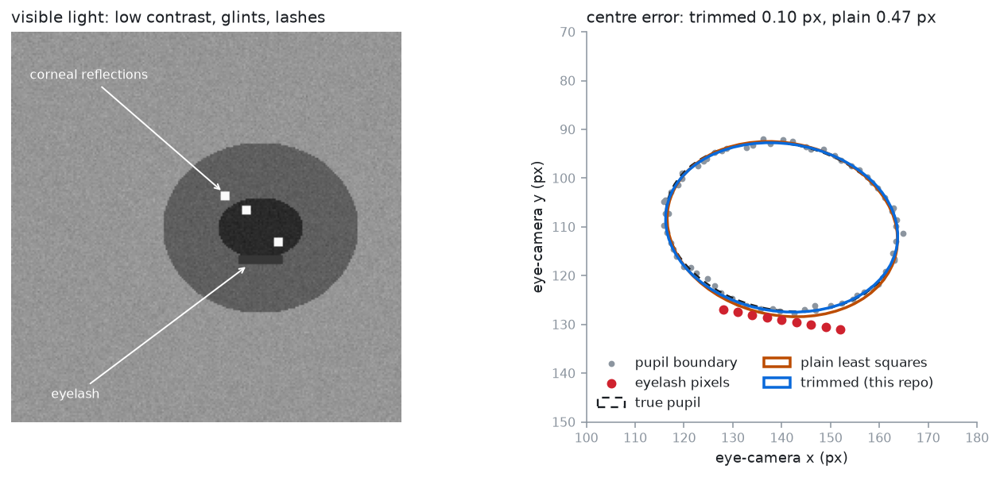
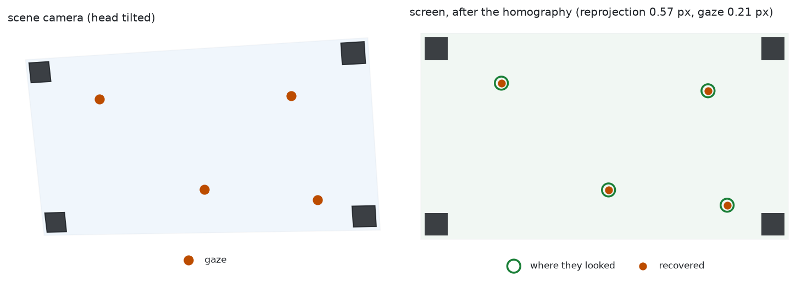
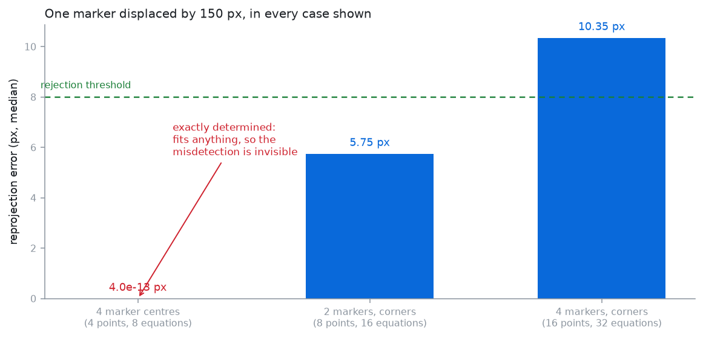
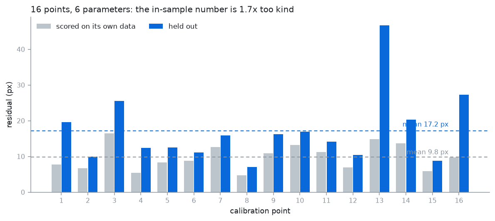

# Head-worn eye tracker on a 3D-printed frame

A pair of printed glasses carrying an eye camera and a scene camera, tracking
the iris in **visible light** — no infrared emitter next to the eye — and
mapping gaze onto a screen using ArUco markers.

The frame is parametric OpenSCAD rather than a dropped STL, so the numbers that
decide whether it fits a given face and a given camera are editable and
readable.

**Status:** personal project, rebuilt and published 2026. Python 3.10+, numpy
only for the core.

```bash
pip install -e ".[dev]"
pytest                             # 58 tests, no hardware
python examples/01_end_to_end.py
python examples/make_figures.py    # redraws docs/figures/
```

---

## Why visible light, and what it costs

Almost every head-worn tracker uses IR illumination, and for a good reason:
under IR the pupil is by far the darkest thing in the image and the boundary is
trivially thresholdable. This rig puts no emitter next to the eye, which costs:

- **Pupil-iris contrast now depends on iris colour.** A dark brown iris gives a
  boundary a threshold can barely find; a blue one is easy. IR does not care.
- **Specular reflections land on the cornea** from whatever is in the room —
  several of them, in unknown places, rather than one known glint.
- **Eyelashes cross the pupil**, are dark, and survive thresholding.

The detection pipeline is built around those three in that order. The ellipse
fit is **robust rather than least-squares**, because least-squares is pulled
badly by exactly the contaminants that survive:



A handful of eyelash pixels drags the plain conic fit off centre. Trimming the
worst-fitting fraction and refitting costs three extra iterations and recovers
the centre to a tenth of a pixel.

---

## Two stages, kept separate

This is the design decision the whole thing rests on.

| | Eye → scene | Scene → screen |
|---|---|---|
| Kind | **fitted**, from calibration | **geometric**, exact |
| Model | degree-2 polynomial | homography |
| Depends on head pose | no | yes |
| Recomputed | once, at calibration | **every frame** |

A flat screen viewed by a pinhole camera is a plane-to-plane projective map, so
a homography is not an approximation here — it is the exact model. And because
head pose lives entirely in that stage, the fitted stage never has to account
for where the head is.



Caching the homography is the bug. The whole point of a head-worn rig is that
the head moves; a homography from one head pose is wrong for every other one.

---

## The over-determination problem

A homography has eight degrees of freedom, and each point correspondence
contributes two equations. So **four points — the four marker centres — fit
exactly, including nonsense ones.** The residual is zero whatever you feed it,
and it cannot tell you a marker was mislabelled or detected in the wrong place.

ArUco detectors return four corners per marker anyway, so this repo keeps all
of them. Four markers become sixteen points, thirty-two equations against eight
unknowns, and reprojection error finally carries information:



There are tests for a displaced marker and for two swapped markers, and both
are caught. There is also a test asserting that four correspondences fit
anything exactly, so the reason for the design cannot quietly be forgotten.

Two markers is the working minimum — the wearer turning their head takes
markers out of frame constantly — and at two the system is already
over-determined, so the check still works.

---

## Numbers

`python examples/01_end_to_end.py`, synthetic wearer, head pose different on
every test frame:

```
Calibration: 12 points, 6 parameters
  in-sample residual        6.41 px   (0.17 deg)
  leave-one-out            13.48 px   (0.36 deg)
  overstatement          2.1x if in-sample is quoted

Test: 200 gaze points, head pose different on every frame
  frames rejected        0 (0.0%)
  accuracy, mean         2.86 deg
  accuracy, median       2.54 deg
  accuracy, p95          5.98 deg
```



Three things in that output worth reading carefully:

1. **The in-sample residual overstates by 2.1×.** Twelve calibration points
   against six parameters leaves half the degrees of freedom. At that ratio the
   in-sample number is not an accuracy estimate, and a repo that quoted 0.17°
   here would be claiming commercial-tracker performance from a printed frame.
2. **The test accuracy is worse again**, at 2.86°. The test points are spread
   across the whole screen, including outside the calibration grid, and the
   head poses are stronger. This is the number that describes the rig.
3. **The map was fitted once** and never refitted, across 200 different head
   poses, with nothing rejected. That is the two-stage separation working.

---

## The frame

`hardware/frame.scad` — parametric, three printable parts.

```bash
openscad -o frame.stl hardware/frame.scad
openscad -o eye_arm.stl -D 'part="eye_arm"' hardware/frame.scad
```

The parameters that actually matter are pupillary distance (get it wrong and
the eye camera looks at a cheekbone), and the eye camera's drop, reach and
pitch. One eye camera, not two: gaze is conjugate for anything beyond arm's
length, so a second doubles the weight, cabling and synchronisation for very
little.

**Print in PETG, not PLA.** The frame sits on a face for an hour at a time, and
PLA softens enough at skin temperature over that period to let the eye arm
droop — which shows up as slow gaze drift that looks exactly like calibration
decay and is not.

---

## What this does not do

- **Parallax is not corrected.** The eye camera sees the eye, not what the eye
  is looking at, so the fitted map is exact only at the depth it was calibrated
  at. Calibrate at a 60 cm screen, look at something 3 m away, and there is a
  systematic offset. Fixing it needs a stereo scene camera or a depth estimate;
  this rig has neither.
- **Slippage is detected, not corrected.** `slippage_indicator` compares the
  recent pupil centroid against the calibration centroid, which catches a bulk
  shift of the glasses on the face. It cannot see frame rotation, and it will
  false-positive on someone who genuinely spent a minute looking at one corner.
  It is something to show the wearer, not to trigger anything automatic.
- **No blink detection beyond the confidence score.** A fit that looks like an
  eyelid edge scores low and is treated as a dropout; there is no dedicated
  blink classifier.
- **Detection itself is not benchmarked on real eye images.** The tests use
  synthetic ellipses degraded in the three ways described above. That validates
  the fitting, not the thresholding, on real skin and real lashes.
- **Monocular.** No vergence, so no depth of gaze.

---

## Layout

```
src/headgaze/
  pupil.py      visible-light pupil detection and robust ellipse fitting
  screen.py     ArUco marker layout, homography, per-frame screen locator
  mapping.py    fitted eye-to-scene map, cross-validation, slippage
hardware/
  frame.scad    parametric glasses frame, three printable parts
examples/
  01_end_to_end.py   the numbers above
  make_figures.py    the figures above
```

---

## License

MIT — see [LICENSE](LICENSE).

Parth Deshmukh
